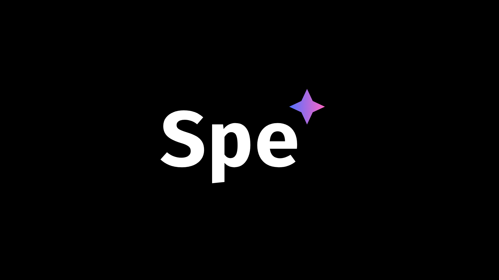

# Spe*

## Syntax
 - Declare Function
```
  declf my_function { // declare
    math result1 5+10; // save as variable
    math result2 $result1*2; // calculate with variables
    print $result1 $result2; // print variables
}
my_function; //call
```
 - Declare variable
```
decl object hello! variable1;// decl type data name
```
## Run the Interpreter

 - Clone the project

- Windows:
```bash
  python main.py
```

- Linux:

```bash
  pip install -r requirements.txt
  python main..py
```
 - MacOS: 🤷 Why do you use MacOS for Coding???

## Contribute
 - Wenn du aus der 1CHIF bist gehe einfach auf den Discord Server!
 - [CHIFEngine Discord](https://discord.gg/KfNVQbYK)

Liste der Mitmachenden:

 - Lukas Rennhofer / @LL-Program
 - Moritz Rottensteiner / 
@Alyopolo

